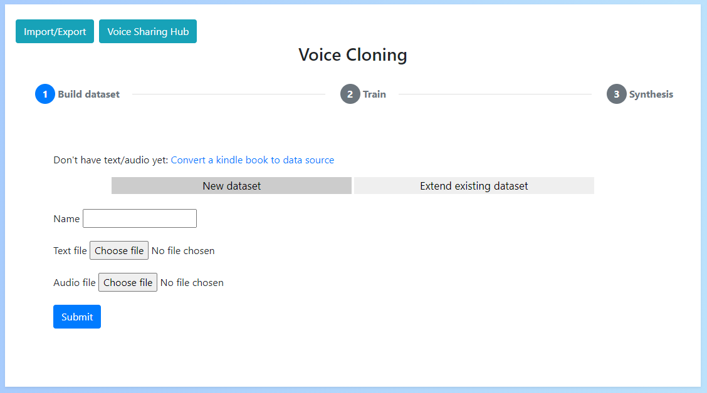

# Voice Cloning App

A Python/Pytorch app for easily synthesising human voices

## Key features
- Automatic dataset generation (with support for subtitles and audiobooks)
- Additional language support
- Local & remote training
- Easy train start/stop
- Data importing/exporting
- Multi GPU support

## Manual Guides
- [Installation](install.md)
- [Building the dataset](dataset/dataset.md)
- [Training](training/training.md)
- [Synthesis](synthesis/synthesis.md)
- [Making changes](maintenance.md)

## Future Improvements
- Add support for Talknet
- Add GTA alignment for Hifi-gan
- Improved batch size estimation
- AMD GPU support

